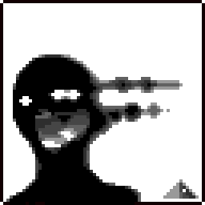

 
 

<h1>All Beginnings Mod</h1>

<h2>About</h2>

The All Beginnings Mod is a project me and the others have been working on for a while now that aims to take inspiration from the concepts and designs of H.P. Lovecraft's creations, while still adding content to enhance the overall experience.

<h2>Links</h2>

<a href="https://discord.gg/kTgr2nZaYU">Discord Server</a>
